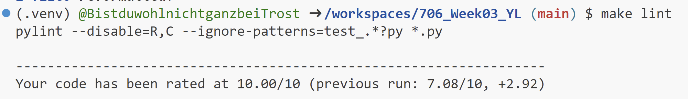
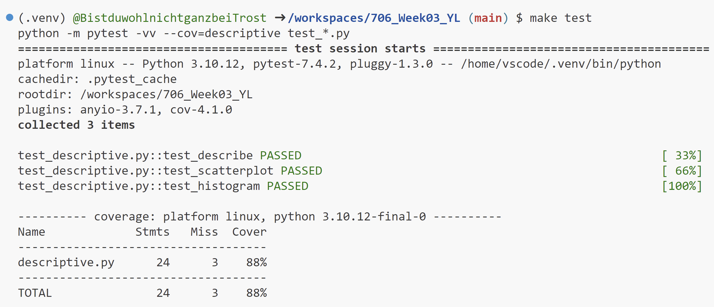

# 706_Week03_YL

This repository includes the main tasks for week 3-Polar Descriptive Statistics:

* A Makefile
* A Dockerfile
* GitHub actions
* Scripts and visualizations calculating the descriptive statistics using `Polars` for the chosen dataset `nba-teams-2017.csv`

## Project description

The project adapts from the project template from Week 01, and add Pandas scripts to output the summary statistics and visualizations of certain features within a given dataset. I used the `nba-teams-2017.csv` dataset, a dataset describing the wins/losses/cumulative points/games statistics for all the NBA teams during regular season 2016-17.

* I calculated the summary statistics (mean/median/standard deviation/IQR) of the quantitative columns.

* I created two visualizations: a histogram of points gain by each team; a scatterplot of points versus number of games won.

## Project environment

* Use codespace for scripting
* Container built in `devcontainers` and virtual environment activated via `requirements.txt`

## Check format & errors

1. make format

2. make lint

3. make test

## Summary statistics

See `report.md` for details.
