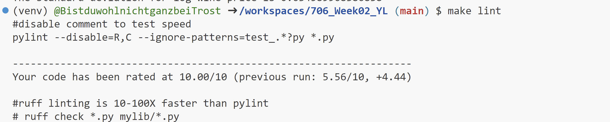
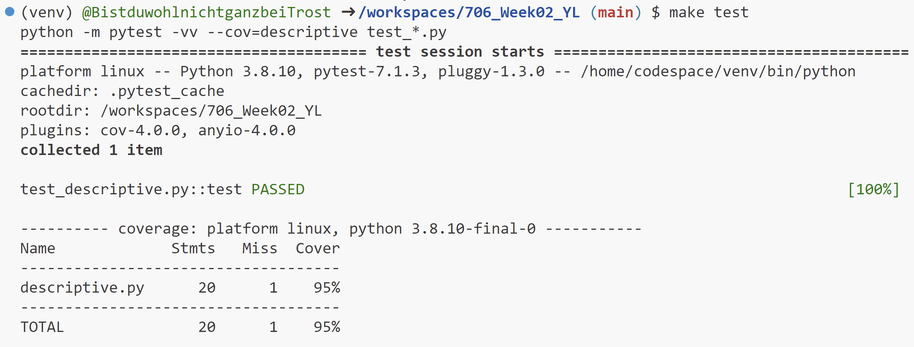

# 706_Week02_YL

This repository includes the main tasks for week 2-Pandas Descriptive Statistics:

* A Makefile
* A Dockerfile
* GitHub actions
* Scripts and visualizations calculating the descriptive statistics of the chosen dataset `wine.csv`

## Project description

The project adapts from the project template from Week 01, and add Pandas scripts to output the summary statistics and visualizations of certain features within a given dataset. I used the `wine.csv` dataset, a dataset describing the quality of red Bordeaux wine from 1952 to 1980.

* I calculated the summary statistics (mean/median/standard deviation) of the column `Price`, the log price of red wine.

* I created two visualizations: a histogram of log wine price; a pairplot of all the quantitative variables in the dataset.

## Project environment

* Use codespace for scripting
* Container built in `devcontainers` and virtual environment activated via `requirements.txt`

## Check format & errors

1. make format

2. make lint

3. make test

## Summary statistics

See `report.md` for details.