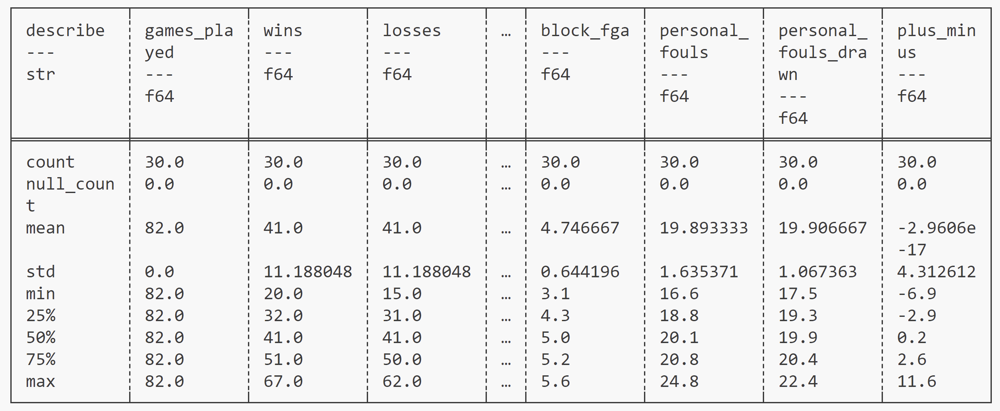
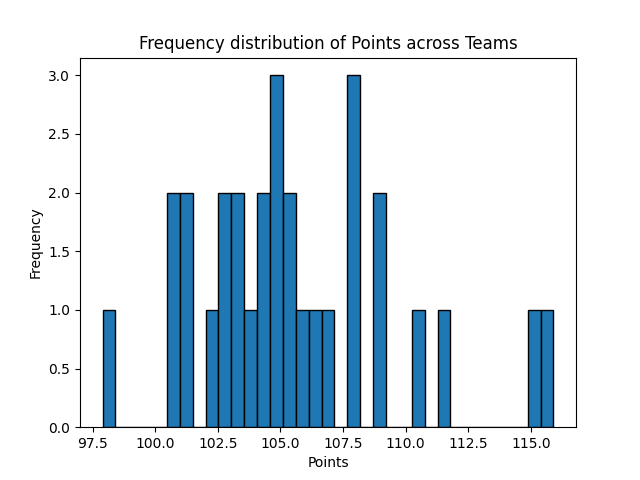

# 706_Week03_YL

This repository includes the main tasks for week 3-Polar Descriptive Statistics:

* `Makefile` is a configuration file used in Unix-based systems for automating tasks and building software. It contains instructions and dependencies for compiling code, running tests, and other development tasks.
* `.devcontainer` includes a Dockerfile and `devcontainer.json`. The `Dockerfile` within this folder specifies how the container should be built, and other settings in this directory may control development environment configurations.
* `Workflows` includes GitHub Actions, which contain configuration files for setting up automated build, test, and deployment pipelines for your project.
* `.gitignore` is used to specify which files or directories should be excluded from version control when using Git.
* `README.md` is the instruction file for the readers.
* `descriptive.py` is a Python file that contains the main function for summary statistics and visualization for the chosen dataset `nba-teams-2017.csv`.
* `test_descriptive.py`  is a test file for `descriptive.py` that can successfully run in IDEs.
* `requirements.txt` is to specify the dependencies (libraries and packages) required to run the project.

## Project description

The project adapts from the project template from Week 01, and replace the `Pandas` scripts (Week 2) with the `Polars` ones to output the summary statistics and visualizations of certain features within a given dataset. I used the `nba-teams-2017.csv` dataset, a dataset describing the wins/losses/cumulative points/games statistics for all the NBA teams during regular season 2016-17.

* I calculated the summary statistics (mean/median/standard deviation/IQR) of the quantitative columns.

* I created two visualizations: a histogram of points gain by each team; a scatterplot of points versus number of games won.

## Project environment

* Use codespace for scripting
* Container built in `devcontainers` and virtual environment activated via `requirements.txt`
* To run the code, use the command `python descriptive.py` in the terminal

## Check format & errors

1. make format

2. make lint

3. make test

## Summary statistics

See `report.md` for details. 

1. Description of the dataset

The dataset includes variables for the wins/losses/cumulative points/games statistics for all the NBA teams during regular season 2016-17. Since there are many columns in the dataset, I only describe the ones that are relevant to the visualizations, or worth discovering for creating other visualizations.

* Team: name of the NBA team (in `str` format, dropped during calculating summary statistics).
* Wins: number of wins for each team.
* Losses: number of losses for each team.
* Win_prop: percentages of games winning.
* Points: cumulative points yielded.
* Field_goals: number of field goals committed.
* Points3: number of 3 point field goals committed.
* Free_throws: number of free throw field goals committed.

2. Summary of the quantitative variables in the dataset

## Visualizations

1. Histogram for points for all teams

2. Scatterplot for points vs number of wins

