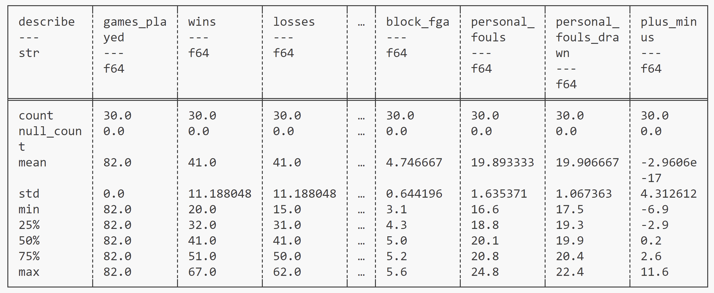
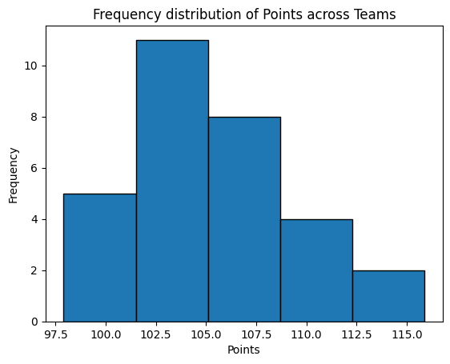

## Summary Statistics

1. Description of the dataset

The dataset includes variables for the wins/losses/cumulative points/games statistics for all the NBA teams during regular season 2016-17. Since there are many columns in the dataset, I only describe the ones that are relevant to the visualizations, or worth discovering for creating other visualizations.

* Team: name of the NBA team (in `str` format).
* Wins: number of wins for each team.
* Losses: number of losses for each team.
* Win_prop: percentages of games winning.
* Points: cumulative points yielded.
* Field_goals: number of field goals committed.
* Points3: number of 3 point field goals committed.
* Free_throws: number of free throw field goals committed.

2. Summary of the quantitative variables in the dataset

3. Descriptive statistics of log price of wine in the dataset

## Visualizations

1. Histogram for points for all teams

2. Scatterplot for points vs number of wins

