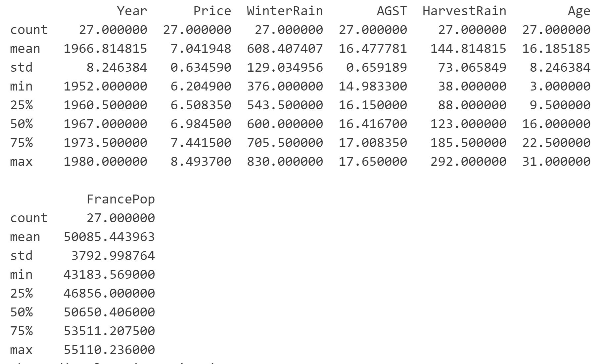
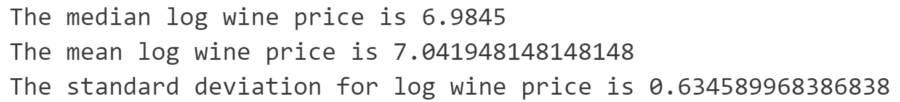
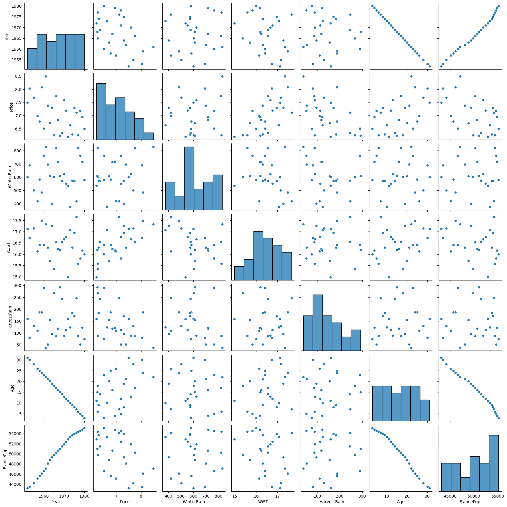

## Summary Statistics

1. Description of the dataset

The dataset includes variables for describing the quality of Red Bordeaux wines across 29 years. 

* Year: year in which grapes were harvested to make wine.
* Price: logarithm of the average market price for Bordeaux vintages according to 1990–1991 auctions. The price is relative to the price of the 1961 vintage, regarded as the best one ever recorded.
* WinterRain: winter rainfall (in mm).
* AGST: Average Growing Season Temperature (in Celsius degrees).
* HarvestRain: harvest rainfall (in mm).
* Age: age of the wine measured as the number of years stored in a cask.
* FrancePop: population of France at Year (in thousands).

2. Summary of the quantitative variables in the dataset

3. Descriptive statistics of log price of wine in the dataset

## Visualizations

1. Histogram for log wine price

2. Pairplot for all variables

