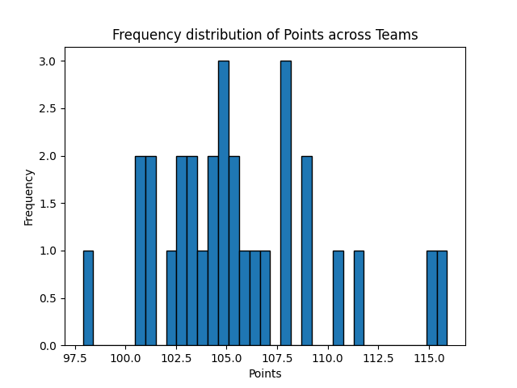
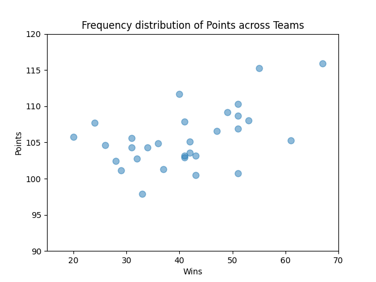

# This is the generated report for summary statistics and visualization for [nba-teams-2017.csv](https://github.com/nogibjj/706_Week03_YL/blob/main/nba-teams-2017.csv).
## Descriptive statistics 

    |    | describe   |   games_played |   wins |   losses |   win_prop |   minutes |   points |   field_goals |   field_goals_attempted |   field_goals_prop |   points3 |   points3_attempted |   points3_prop |   free_throws |   free_throws_att |   free_throws_prop |   off_rebounds |   def_rebounds |   rebounds |   assists |   turnovers |    steals |   blocks |   block_fga |   personal_fouls |   personal_fouls_drawn |   plus_minus |
|---:|:-----------|---------------:|-------:|---------:|-----------:|----------:|---------:|--------------:|------------------------:|-------------------:|----------:|--------------------:|---------------:|--------------:|------------------:|-------------------:|---------------:|---------------:|-----------:|----------:|------------:|----------:|---------:|------------:|-----------------:|-----------------------:|-------------:|
|  0 | count      |             30 | 30     |   30     |  30        | 30        |  30      |      30       |                30       |           30       |  30       |            30       |       30       |      30       |          30       |           30       |        30      |       30       |   30       |  30       |    30       | 30        | 30       |   30        |         30       |               30       | 30           |
|  1 | null_count |              0 |  0     |    0     |   0        |  0        |   0      |       0       |                 0       |            0       |   0       |             0       |        0       |       0       |           0       |            0       |         0      |        0       |    0       |   0       |     0       |  0        |  0       |    0        |          0       |                0       |  0           |
|  2 | mean       |             82 | 41     |   41     |   0.499967 | 48.3167   | 105.59   |      39.05    |                85.4167  |           45.72    |   9.65    |            27.0033  |       35.7167  |      17.8333  |          23.11    |           77.18    |        10.1333 |       33.3767  |   43.52    |  22.6267  |    13.96    |  7.71     |  4.74    |    4.74667  |         19.8933  |               19.9067  | -2.96059e-17 |
|  3 | std        |              0 | 11.188 |   11.188 |   0.136448 |  0.131525 |   4.1289 |       1.42581 |                 2.22944 |            1.36594 |   1.61965 |             4.11645 |        1.80308 |       1.55504 |           1.85869 |            2.77668 |         1.2313 |        1.17787 |    1.71653 |   2.21623 |     1.27051 |  0.656716 |  0.70886 |    0.644196 |          1.63537 |                1.06736 |  4.31261     |
|  4 | min        |             82 | 20     |   15     |   0.244    | 48.1      |  97.9    |      36.2     |                79.5     |           43.5     |   7.3     |            21       |       32.7     |      13.9     |          18.5     |           70.6     |         7.9    |       30.7     |   38.6     |  18.5     |    11.5     |  6.6      |  3.7     |    3.1      |         16.6     |               17.5     | -6.9         |
|  5 | 25%        |             82 | 32     |   31     |   0.39     | 48.2      | 102.9    |      38.1     |                84.4     |           44.7     |   8.6     |            23.9     |       34.1     |      17       |          22.1     |           74.8     |         9      |       32.6     |   42.8     |  21.1     |    13.3     |  7.1      |  4.1     |    4.3      |         18.8     |               19.3     | -2.9         |
|  6 | 50%        |             82 | 41     |   41     |   0.5      | 48.3      | 105.1    |      39.3     |                85.4     |           45.5     |   9.4     |            26.1     |       35.7     |      18       |          23.2     |           77.6     |        10.1    |       33.5     |   43.6     |  22.5     |    13.8     |  7.8      |  4.8     |    5        |         20.1     |               19.9     |  0.2         |
|  7 | 75%        |             82 | 51     |   50     |   0.622    | 48.4      | 107.9    |      39.6     |                87.1     |           46.7     |  10.4     |            28.8     |       37.2     |      19.2     |          24.2     |           79.6     |        11.1    |       34.4     |   44.4     |  23.8     |    15       |  8.2      |  5       |    5.2      |         20.8     |               20.4     |  2.6         |
|  8 | max        |             82 | 67     |   62     |   0.817    | 48.6      | 115.9    |      43.1     |                88.8     |           49.5     |  14.4     |            40.3     |       39.1     |      20.4     |          26.5     |           81.5     |        12.2    |       35.1     |   46.6     |  30.4     |    16.7     |  9.6      |  6.8     |    5.6      |         24.8     |               22.4     | 11.6         | 
    
## Here are some plots to visualize relations between the important variables described in README. 
### Histogram for Cumulative Points for all the teams during the season 
 
### Scatterplot for number of games won versus cumulative points for all teams during the season 
